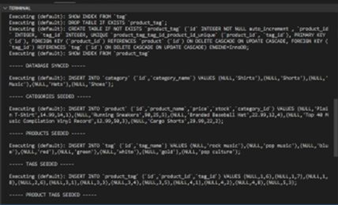
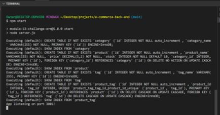
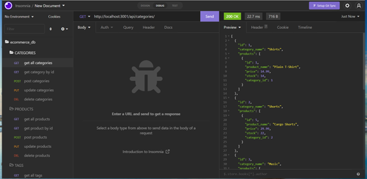

# **E-Commerce Back End**

## **Description**
The purpose of this project was to build a back end for an e-commerce site and to configure a working Express.js API to use Sequelize to interact with a MySQL database in order to perform CRUD operations. 

 

## **Table of Contents**
[User Story](#user-story) 
[Acceptance Criteria](#acceptance-criteria) 
[Installation](#installation) 
[Usage](#usage) 
[License](#license) 
[Contributing](#contributing) 
[Tests](#tests) 
[Built With](#built-with) 
[Walkthrough Video](#video-of-e-commerce-back-end) 

 

### **User Story**
AS A manager at an internet retail company 
I WANT a back end for my e-commerce website that uses the latest technologies 
SO THAT my company can compete with other e-commerce companies 

### **Acceptance Criteria**
GIVEN a functional Express.js API  
WHEN I add my database name, MySQL username, and MySQL password to an environment variable file  
THEN I am able to connect to a database using Sequelize  
WHEN I enter schema and seed commands  
THEN a development database is created and is seeded with test data  
WHEN I enter the command to invoke the application  
THEN my server is started and the Sequelize models are synced to the MySQL database  
WHEN I open API GET routes in Insomnia for categories, products, or tags  
THEN the data for each of these routes is displayed in a formatted JSON  
WHEN I test API POST, PUT, and DELETE routes in Insomnia  
THEN I am able to successfully create, update, and delete data in my database  

 

### **Installation**
(1) Click [here](https://nodejs.org/en/) to install Node.js on your local machine if you haven't already done so. Choose the latest LTS version for the most recent stable release.
   
(2) Download MySQL onto your machine if you haven't already done so. Use the following installation guide for detailed instructions on how to do this: 
https://coding-boot-camp.github.io/full-stack/mysql/mysql-installation-guide
  
(3) Clone this repository on your local machine.  
(4) Navigate to the repository folder.  
(5) Type the following command in the command line to download all required packages/modules.dependencies: 

    npm install

 

### **Usage**
(1) In order to connect to a MySQL database, you must create a .env file that contains the following information:

    DB_NAME = 'ecommerce_db'
    DB_USER = 'yourusername'
    DB_PW = 'yourpassword'

(2) Enter the following in the command line:

    mysql -u root -p 

This will prompt you to enter your MySQL password. 
 
 
(3) After you enter your password, you will see the MySQL command line. Enter the following command in the command line:

    source db/schema;

You should see the following lines printed in the command line indicating that the database has been successfully created:

    Query OK, 4 rows affected (0.17 sec)
    Query OK, 1 row affected (0.01 sec)

(4) Type "quit" in the MySQL command line. Then type the following in the command line to seed the SQL database:

    node seeds/index.js

You should see numerous SQL statements and then confirmation of data having been seeded:

(5) Type the following command:

    npm start

OR

    node server.js

You should see the following image in your command line indicating that the server is started and the Sequelize models are synced to the MySQL database:

 
 

(6) You can open API GET routes for categories, products, or tags in Insomnia and view the data for each route in a formatted JSON. You can also test API POST, PUT, and DELETE routes in Insomnia to create, update, and delete data in the database. Visit the [Walkthrough Video](#video-of-e-commerce-back-end) to see all routes in action in Insomnia. Below is a sample picture of the GET route for all categories in Insomnia:

 

### **License**
This project is covered under the following license: ISC 
https://opensource.org/licenses/ISC

 

### **Contributing**
This project does not include any contributors

 

### **Tests**
No tests were utilized in the creation of this application.

 

### **Built With**
* JavaScript
* Node.js
* MySQL
* Express.js
* Sequelize
* dotenv 
* mysql2

 

### **Video of E-Commerce Back End**
https://drive.google.com/file/d/1TbCglYm2l_k9ycyw7vveUoNs8jDgKBWu/view